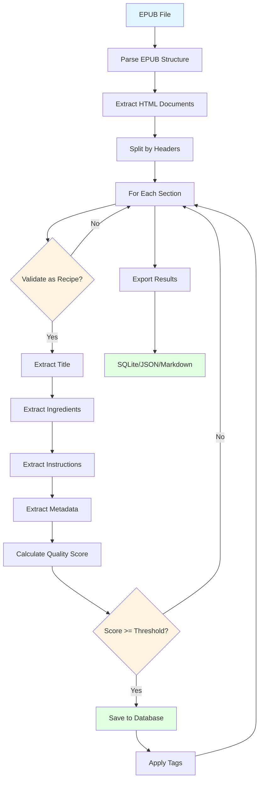

# EPUB Recipe Parser

[](https://www.python.org/downloads/)
[](https://opensource.org/licenses/MIT)
[](https://github.com/psf/black)

Extract structured recipe data from EPUB cookbook files with high accuracy using advanced HTML parsing, TOC analysis, and quality scoring.

## Features

- 📚 **Direct EPUB Parsing**: Extract recipes from EPUB files without conversion to markdown
- 🎯 **High Accuracy**: Smart pattern recognition for ingredients, instructions, and metadata
- 🧠 **Pattern-Based Extraction**: Multi-dimensional confidence scoring using structural, pattern, and linguistic analysis
- 📊 **Quality Scoring**: Automatic quality assessment of extracted recipes (0-100 scale)
- 🧪 **A/B Testing**: Built-in framework for comparing extraction strategies
- 🔍 **TOC Analysis**: Validate extraction completeness using table of contents
- 💾 **Multiple Outputs**: Export to SQLite, JSON, or Markdown formats
- 🚀 **CLI & API**: Use as a library or command-line tool
- ⚡ **Batch Processing**: Process multiple cookbooks efficiently

## Installation

```bash
pip install epub-recipe-parser
```

For development:

```bash
git clone https://github.com/YOUR_USERNAME/epub-recipe-parser.git
cd epub-recipe-parser
uv pip install -e ".[dev]"
```

## Quick Start

### As a Library

```python
from epub_recipe_parser import extract_recipes

# Simple extraction
recipes = extract_recipes("cookbook.epub")

for recipe in recipes:
    print(f"{recipe.title} (Score: {recipe.quality_score})")
    print(f"  Ingredients: {len(recipe.ingredients or '')} chars")
    print(f"  Instructions: {len(recipe.instructions or '')} chars")
```

### CLI Usage

```bash
# Extract recipes from a single EPUB
epub-parser extract cookbook.epub --output recipes.db

# Batch process multiple EPUBs
epub-parser batch ./cookbooks/ --output all_recipes.db

# Analyze EPUB structure
epub-parser analyze cookbook.epub

# Validate extraction against TOC
epub-parser validate cookbook.epub recipes.db

# Export to JSON
epub-parser export recipes.db --format json --output recipes.json
```

## How It Works

The parser uses a multi-strategy extraction pipeline:



### Process Steps

1. **HTML Structure Analysis**: Directly parses EPUB HTML content preserving structure
2. **Section Splitting**: Intelligently splits documents by headers to isolate recipes
3. **Pattern-Based Extraction**: Multi-strategy extraction using:
   - **Structural Detection**: Finds zones via CSS classes, Schema.org, headers
   - **Pattern Matching**: Confidence scoring for extracted content
   - **Linguistic Analysis**: Quality assessment of text patterns
4. **Quality Scoring**: Scores each recipe based on completeness and structure
5. **TOC Validation**: Compares extracted recipes against the book's table of contents

## Quality Scores

Recipes are scored 0-100 based on:

- Ingredients quality (40 points max)
- Instructions quality (40 points max)
- Metadata presence (20 points max)

Typical filtering: Keep recipes with score ≥ 20 for good results, ≥ 70 for excellent quality.

## Advanced Usage

### Custom Configuration

```python
from epub_recipe_parser import EPUBRecipeExtractor, ExtractorConfig

config = ExtractorConfig(
    min_quality_score=50,
    extract_toc=True,
    split_by_headers=True,
    use_pattern_extraction=True  # Enable pattern-based extraction (default: True)
)

extractor = EPUBRecipeExtractor(config=config)
recipes = extractor.extract_from_epub("cookbook.epub")

# Access extraction metadata
for recipe in recipes:
    meta = recipe.metadata.get("extraction", {}).get("ingredients", {})
    if meta:
        print(f"{recipe.title}: confidence={meta.get('confidence', 0):.2f}")
```

#### Configuration Options

- `min_quality_score`: Minimum quality threshold (0-100, default: 20)
- `extract_toc`: Extract table of contents data (default: True)
- `split_by_headers`: Split documents by headers (default: True)
- `use_pattern_extraction`: Use pattern-based extraction with confidence scoring (default: True)
  - When `True`: Returns confidence scores and extraction metadata
  - When `False`: Uses legacy extraction method (for compatibility)
- `validate_recipes`: Validate sections as recipes before extraction (default: True)
- `include_raw_content`: Include raw HTML in recipe data (default: True)

### TOC Analysis

```python
from epub_recipe_parser.analyzers import TOCAnalyzer

analyzer = TOCAnalyzer()
toc_entries = analyzer.extract_toc_recipes("cookbook.epub")
validation = analyzer.validate_extraction(recipes, toc_entries)

print(f"Coverage: {validation.coverage * 100:.1f}%")
print(f"Missing: {len(validation.missing)} recipes")
```

## Pattern-Based Extraction Architecture

The parser uses a modern, multi-dimensional extraction strategy for maximum accuracy:

### Extraction Components

Each component (ingredients, instructions, metadata) uses **three complementary approaches**:

1. **Structural Detection**
   - Finds content zones in HTML using CSS classes, IDs, Schema.org microdata
   - Example: `<div class="recipe-ingredients">` → High confidence zone

2. **Pattern Matching**
   - Analyzes text patterns with confidence scoring (0.0-1.0)
   - Ingredients: Checks for measurements, descriptors, list structure
   - Instructions: Detects cooking verbs, temporal markers, imperative sentences
   - Metadata: Identifies servings, times, methods with numeric patterns

3. **Linguistic Analysis**
   - Assesses text quality using domain-specific indicators
   - Validates that extracted content matches expected linguistic patterns

### Combined Confidence Score

Final confidence = (Structural × 0.30) + (Pattern × 0.50) + (Linguistic × 0.20)

This multi-dimensional approach achieves **100% agreement** with legacy methods while adding valuable confidence metrics.

### A/B Testing Framework (Deprecated)

> **Note**: A/B testing is now deprecated in favor of the default pattern-based extraction with confidence scoring. The pattern-based method is now the default and provides built-in quality metrics.

Legacy A/B testing framework (for historical reference):

```python
# DEPRECATED: Use use_pattern_extraction instead
config = ExtractorConfig(
    enable_ab_testing=True,  # Deprecated
    ab_test_use_new=False,  # Deprecated
    min_quality_score=20
)
```

**Migration**: Replace A/B testing with pattern extraction metadata:

```python
# NEW APPROACH: Use pattern-based extraction (default)
config = ExtractorConfig(
    use_pattern_extraction=True,  # Default behavior
    min_quality_score=20
)

extractor = EPUBRecipeExtractor(config)
recipes = extractor.extract_from_epub("cookbook.epub")

# Access confidence scores directly
for recipe in recipes:
    extraction = recipe.metadata.get('extraction', {})
    ingredients_meta = extraction.get('ingredients', {})
    print(f"{recipe.title}:")
    print(f"  Strategy: {ingredients_meta.get('strategy', 'N/A')}")
    print(f"  Confidence: {ingredients_meta.get('confidence', 0):.2f}")
    print(f"  Combined Score: {ingredients_meta.get('combined_score', 0):.2f}")
```

## Project Structure

```
epub-recipe-parser/
├── src/epub_recipe_parser/
│   ├── core/
│   │   ├── extractor.py    # Main EPUBRecipeExtractor
│   │   ├── models.py       # Recipe and config dataclasses
│   │   ├── validator.py    # Recipe validation logic
│   │   ├── quality.py      # Quality scoring
│   │   └── patterns/       # Pattern-based detection (NEW)
│   │       ├── detectors.py           # Pattern detectors
│   │       ├── analyzers.py           # Linguistic analysis
│   │       ├── structural.py          # HTML zone detection
│   │       ├── instruction_*.py       # Instruction patterns
│   │       └── metadata_*.py          # Metadata patterns
│   ├── extractors/         # Component extractors
│   │   ├── ingredients.py  # Multi-strategy ingredient extraction
│   │   ├── instructions.py # Instruction extraction + patterns
│   │   └── metadata.py     # Metadata extraction + patterns
│   ├── analyzers/          # TOC and structure analysis
│   ├── storage/            # Database and export functionality
│   ├── cli/                # Command-line interface
│   └── utils/              # Shared utilities
```

## Contributing

Contributions are welcome! Please see [CONTRIBUTING.md](CONTRIBUTING.md) for guidelines.

## License

MIT License - see [LICENSE](LICENSE) for details.

## Acknowledgments

Built for the [Open Fire Cooking](https://github.com/yourusername/open-fire-cooking) project, extracting recipes from outdoor cooking and BBQ cookbooks.

## Links

- [Documentation](https://epub-recipe-parser.readthedocs.io)
- [PyPI Package](https://pypi.org/project/epub-recipe-parser/)
- [Issue Tracker](https://github.com/yourusername/epub-recipe-parser/issues)
- [Changelog](CHANGELOG.md)
