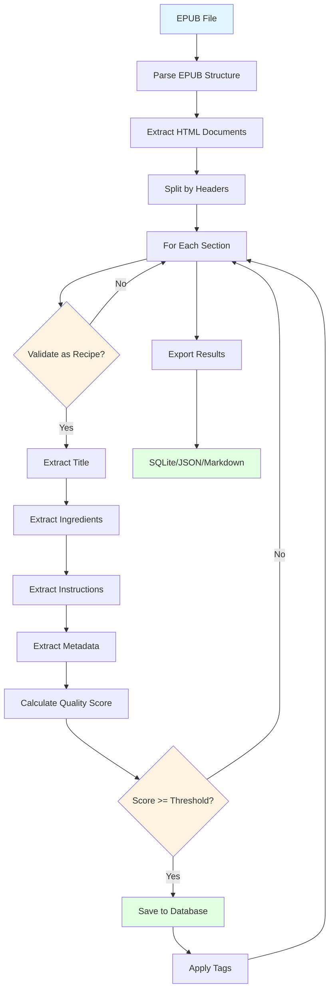

# EPUB Recipe Parser

[](https://www.python.org/downloads/)
[](https://opensource.org/licenses/MIT)
[](https://github.com/psf/black)

Extract structured recipe data from EPUB cookbook files with high accuracy using advanced HTML parsing, TOC analysis, and quality scoring.

## Features

- 📚 **Direct EPUB Parsing**: Extract recipes from EPUB files without conversion to markdown
- 🎯 **High Accuracy**: Smart pattern recognition for ingredients, instructions, and metadata
- 📊 **Quality Scoring**: Automatic quality assessment of extracted recipes (0-100 scale)
- 🔍 **TOC Analysis**: Validate extraction completeness using table of contents
- 💾 **Multiple Outputs**: Export to SQLite, JSON, or Markdown formats
- 🚀 **CLI & API**: Use as a library or command-line tool
- ⚡ **Batch Processing**: Process multiple cookbooks efficiently

## Installation

```bash
pip install epub-recipe-parser
```

For development:

```bash
git clone https://github.com/YOUR_USERNAME/epub-recipe-parser.git
cd epub-recipe-parser
uv pip install -e ".[dev]"
```

## Quick Start

### As a Library

```python
from epub_recipe_parser import extract_recipes

# Simple extraction
recipes = extract_recipes("cookbook.epub")

for recipe in recipes:
    print(f"{recipe.title} (Score: {recipe.quality_score})")
    print(f"  Ingredients: {len(recipe.ingredients or '')} chars")
    print(f"  Instructions: {len(recipe.instructions or '')} chars")
```

### CLI Usage

```bash
# Extract recipes from a single EPUB
epub-parser extract cookbook.epub --output recipes.db

# Batch process multiple EPUBs
epub-parser batch ./cookbooks/ --output all_recipes.db

# Analyze EPUB structure
epub-parser analyze cookbook.epub

# Validate extraction against TOC
epub-parser validate cookbook.epub recipes.db

# Export to JSON
epub-parser export recipes.db --format json --output recipes.json
```

## How It Works

The parser uses a multi-strategy extraction pipeline:



### Process Steps

1. **HTML Structure Analysis**: Directly parses EPUB HTML content preserving structure
2. **Section Splitting**: Intelligently splits documents by headers to isolate recipes
3. **Pattern Recognition**: Uses regex and heuristics to identify ingredients and instructions
4. **Quality Scoring**: Scores each recipe based on completeness and structure
5. **TOC Validation**: Compares extracted recipes against the book's table of contents

## Quality Scores

Recipes are scored 0-100 based on:

- Ingredients quality (40 points max)
- Instructions quality (40 points max)
- Metadata presence (20 points max)

Typical filtering: Keep recipes with score ≥ 20 for good results, ≥ 70 for excellent quality.

## Advanced Usage

### Custom Configuration

```python
from epub_recipe_parser import EPUBRecipeExtractor, ExtractorConfig

config = ExtractorConfig(
    min_quality_score=50,
    extract_toc=True,
    split_by_headers=True
)

extractor = EPUBRecipeExtractor(config=config)
recipes = extractor.extract_from_epub("cookbook.epub")
```

### TOC Analysis

```python
from epub_recipe_parser.analyzers import TOCAnalyzer

analyzer = TOCAnalyzer()
toc_entries = analyzer.extract_toc_recipes("cookbook.epub")
validation = analyzer.validate_extraction(recipes, toc_entries)

print(f"Coverage: {validation.coverage * 100:.1f}%")
print(f"Missing: {len(validation.missing)} recipes")
```

## Architecture

```
epub-recipe-parser/
├── src/epub_recipe_parser/
│   ├── core/          # Main extraction logic
│   ├── analyzers/     # TOC and structure analysis
│   ├── extractors/    # Specialized component extractors
│   ├── storage/       # Database and export functionality
│   ├── cli/           # Command-line interface
│   └── utils/         # Shared utilities
```

## Contributing

Contributions are welcome! Please see [CONTRIBUTING.md](CONTRIBUTING.md) for guidelines.

## License

MIT License - see [LICENSE](LICENSE) for details.

## Acknowledgments

Built for the [Open Fire Cooking](https://github.com/yourusername/open-fire-cooking) project, extracting recipes from outdoor cooking and BBQ cookbooks.

## Links

- [Documentation](https://epub-recipe-parser.readthedocs.io)
- [PyPI Package](https://pypi.org/project/epub-recipe-parser/)
- [Issue Tracker](https://github.com/yourusername/epub-recipe-parser/issues)
- [Changelog](CHANGELOG.md)
